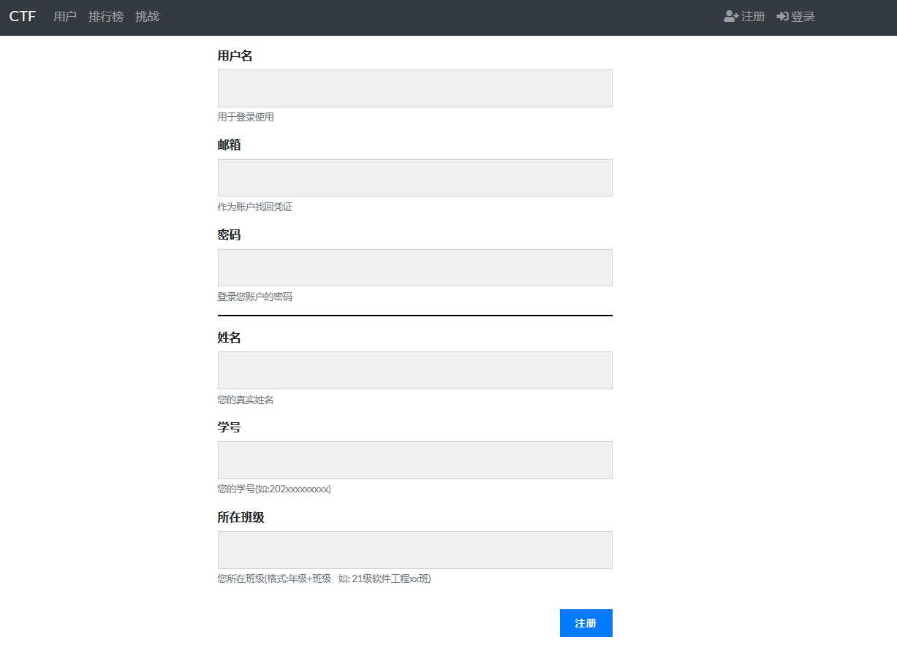

# Campus-CTF

#### 介绍
---
Campus-CTF是基于CTFd-V3.4.1汉化的修改版本。同时新增了学生姓名、学号等注册字段，使得适合部署成为校园版的CTF比赛平台。 

官方的[CTFd](https://github.com/CTFd/CTFd)版本几乎是全英文版的，这很显然是不适合在国内部署的。不过有[大佬](https://github.com/Gu-f)对官方版本做了[汉化版本](https://github.com/Gu-f/CTFd_chinese_CN)，使得CTFd更适合于我们在国内部署。但是如果将其在校园内部署的话，在注册时又缺少了学生的一些相关信息，由此便有了Campus-CTF版本。
  
官方网站请访问：[https://ctfd.io/](https://ctfd.io/) 
官方在线预览版：[https://demo.ctfd.io/](https://demo.ctfd.io/) 
官方最新版请访问：[https://github.com/CTFd/CTFd](https://github.com/CTFd/CTFd) 

#### 安装
---
##### Python
1.  将本仓库克隆到本地
2.  cd到拉取下来的项目下
3.  安装依赖环境: pip install -r requirements.txt
4.  运行： python serve.py  或 flask run
 

##### Docker
1.  在项目下使用docker compose安装：docker-compose up 
 

#### 更多
---
- 主题: [Christopher Thompson](https://github.com/breadchris)

 

#### 参与贡献
---
1.  Fork 本仓库
2.  新建 Feat_xxx 分支
3.  提交代码
4.  新建 Pull Request